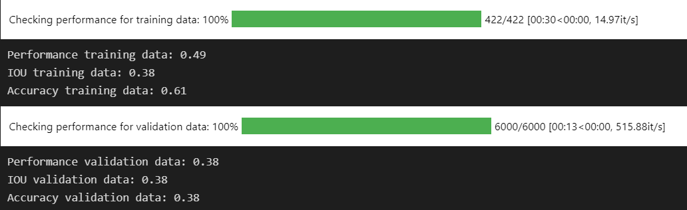
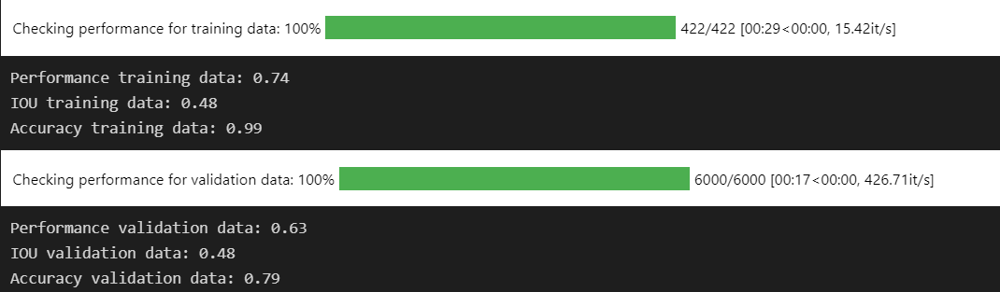
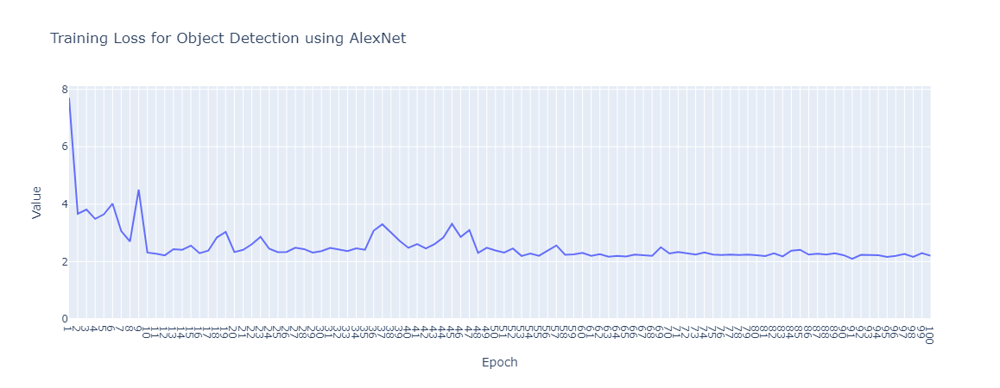
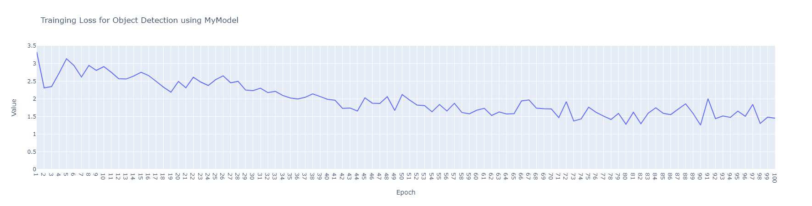
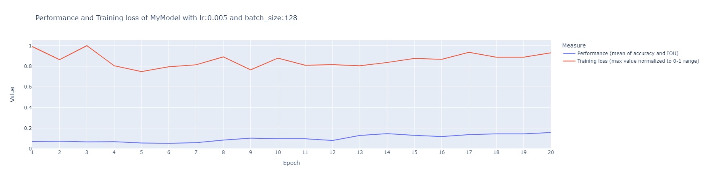
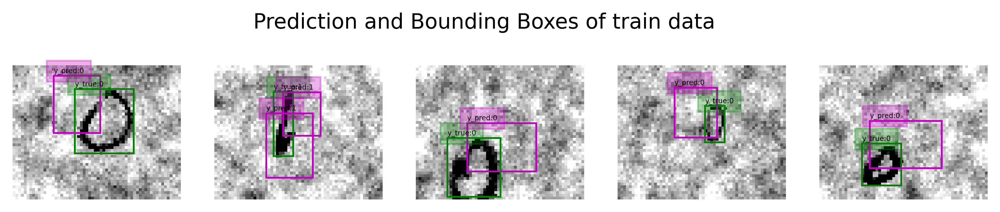
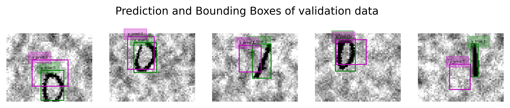
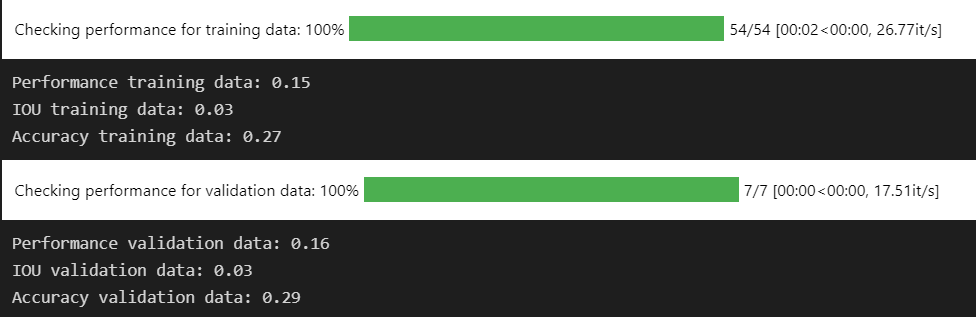
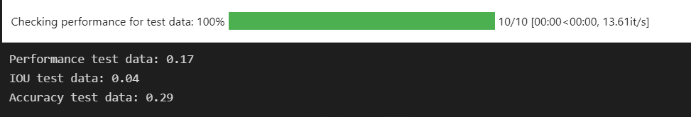
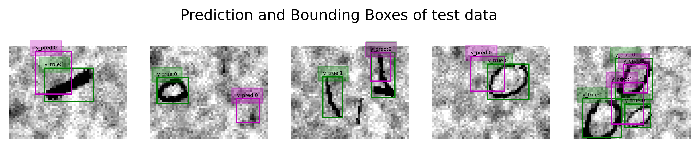

# Report Project 2 - igu011 and edj001

## Division of labor

We (igu011 and edj001) have worked very closely and paired programmed this project. Since Ingrid was sick part of the time we halted the work so that we could continue together. This is why the project is delivered a bit later since Ingrid communicated and got a postponement from Pekka.

## Collabaration

We have had discussions with Alvar Hønsi during this project. We have not shared code but exchanged ideas and sources on how to solve the subproblems that come about during this project.

## Object Localization

### Explanation of approach, design choices, models, and hyper-parameters utilized

We first tested out the LeNet5 model architecture. We quickly saw that we did not get good performance with this architecture så we started tweaking. We saw that we needed more classes in the classifier to be able to distinguish the 10 classes. We implemented this in MyModel. We also tried out different combinations and depths of Convolutional layers, activators, and pooling. We found the best results in switching activation from Tanh to ReLu, utilizing batch normalization and max pool. When it comes to the depth of convolutional layers we tried in range 1 to 5, but for best results with 2 convolutional layers.

For batch size and learning rate, we went with 128 and 0.005 respectively. We saw improved performance for MyModel with higher batch size and tested values ranging from 10 to 300.

### Plots

LeNet performance:

MyModel performance:

### Training data prediction

### Validation data prediction

### Results and performance of the selected model

## Object Detection

### Explanation of approach and design choices, models, and hyper-parameters utilized

We first tried with AlexNet, which is similar to LeNet, but deeper, has more filters, stacked convolutional layers, max-pooling, and dropout. Since we have an increase from 15 to 42 features for the output layer we thought that a deeper model would better be able to pick up op features. As the plots below show we did not get good results from AlexNet with a dropout_rate of 0.5, lr of 0.001, batch_size of 64, using Adam optimizer, even when we tried with 100 epochs the training loss stagnated at a value of 2.

Next, we tried to change the previously successful MyModel to the detection task. We changed the output layer number of features and saw much better training loss with the same parameters as mentioned and the same 100 epochs. We continued tweaking this model and ended up with a batch_size of 128, lr of 0.005, and over 20 epochs we saw a slight performance improvement.

### Plots

### Training data prediction

### Validation data prediction

### Results and performance of selected model

We think that the results were not so good because the compute-heavy task did not have enough time to train long enough. We could also get better results with a deeper model, maybe not the AlexNet architecture but another one. We also thought at the end of this project that it could be smart to split the input to the model in the forward function into the three categories pc, (H * W) tensor of BB, and the two classes 0 and 1. Maybe the Model had a hard time figuring out what features were representing classification and features of an image.
