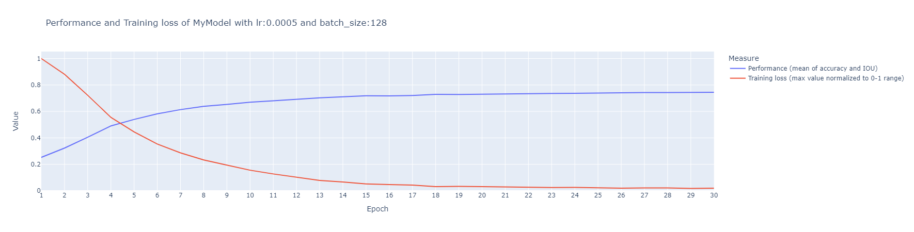
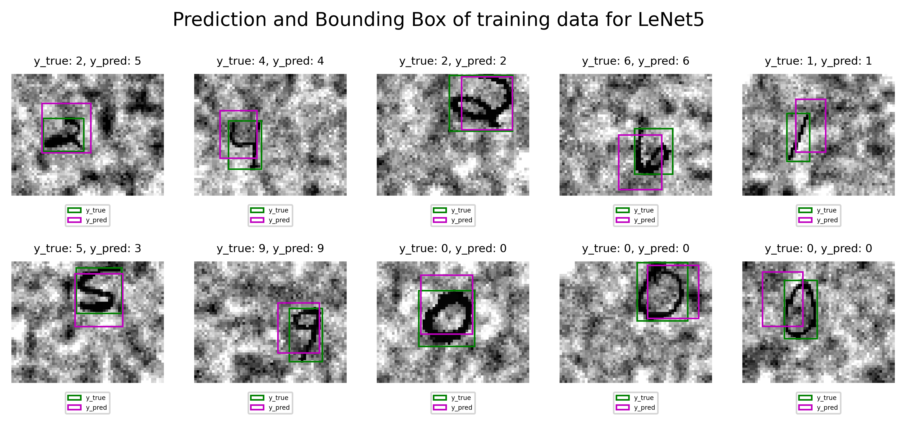
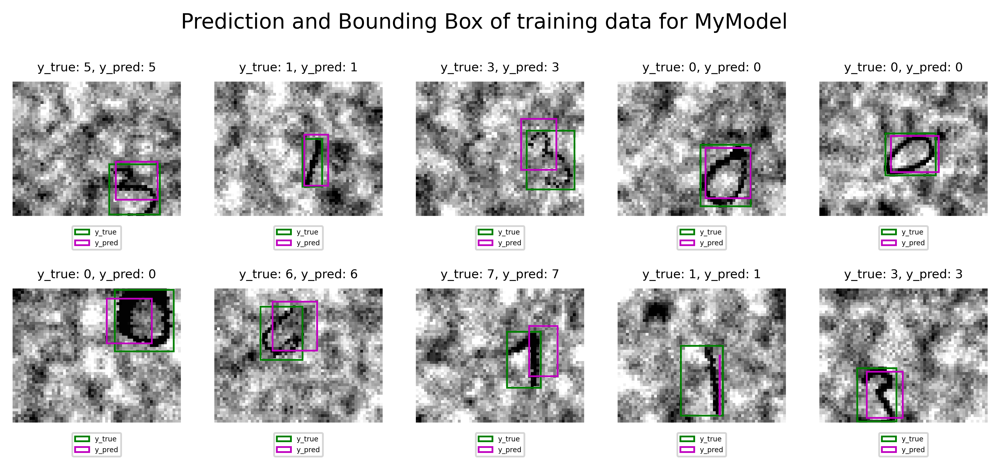
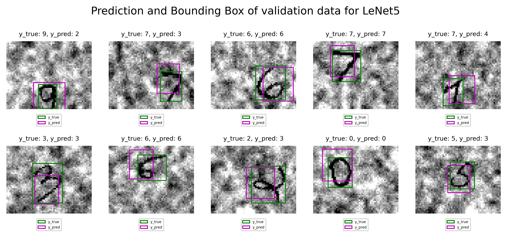
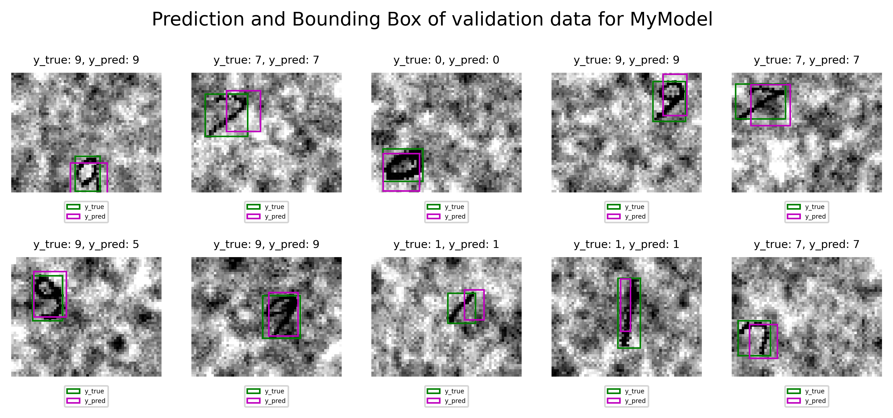
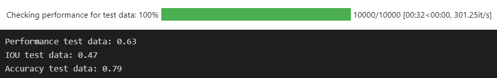
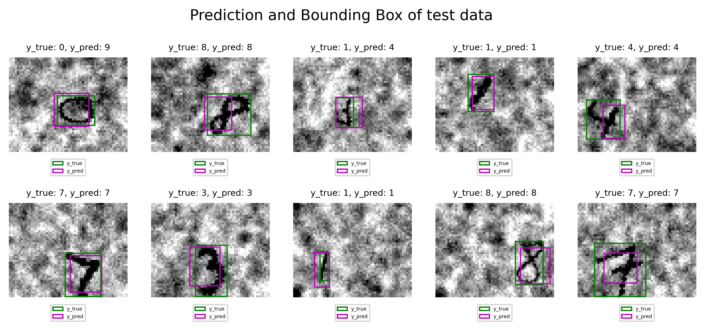

# Report Project 2 - igu011 and edj001

## Division of labor

We (igu011 and edj001) ...

## Collabaration

We have had discussions with Alvar Hønsi...

## Object Localization

### Explanation of approach, design choices, models and hyper-parameters utilized

We first tested out the LeNet5 model architecture. We quickly saw that we did not get good performance with this architecture så we started tweaking. We saw that we needed more classes in the classifier to be able to distinguish the 10 classes. We implemented this in MyModel. We also tried out different combinations and depths of Convolutional layers, activators and pooling. We found the best results switching activation from Tanh to ReLu, utilizing batchnormalization and maxpool. Whn iut comes to depth of convulitional layers we tried in range 1 to 5, but gor best results with 2 convuluational layers.

For batch size and learning rate we went with 128 and 0.005 respectivly. We saw improved performance for MyModel with a higher batch size and tested values ranging from 10 to 300.

### Plots

### Training

### Validation

### Results and performance of selected model

## Object Detection

### Explanation of approach and design choices

### Models and hyper-parameters utilized

### Performance of selected model

- accuracy
- IoU
- mean between of accuracy and IoU???

### Plots

#### Training

showing the true bounding boxes and label compared to the predicted bounding
boxes and labels

#### Validation

showing the true bounding boxes and label compared to the predicted bounding
boxes and labels

### Results

In case you do not get expected results, try to give potential reasons
that would explain why your code does not work and/or your results differ.
