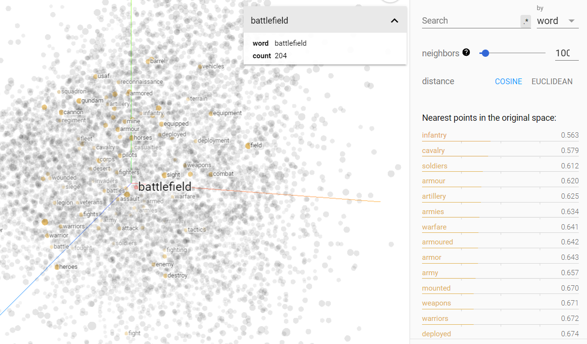
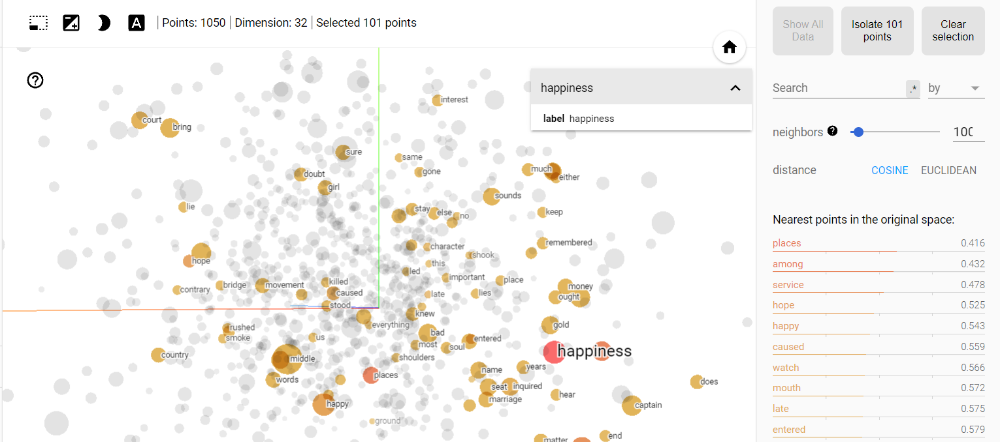
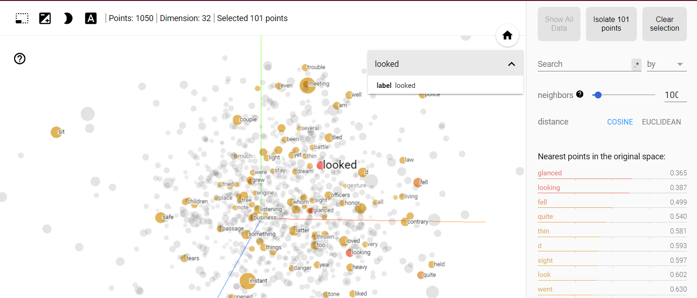
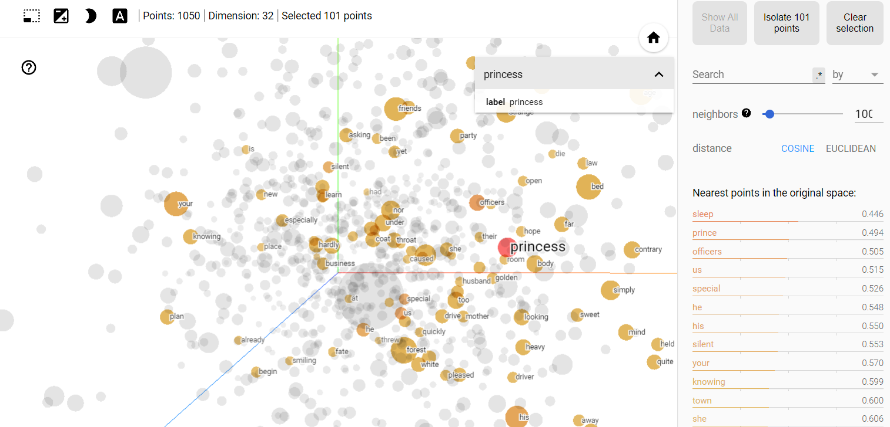
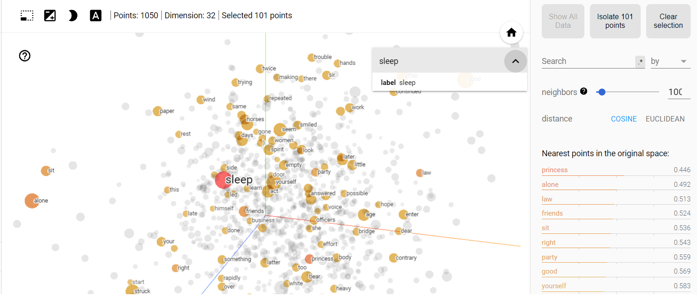
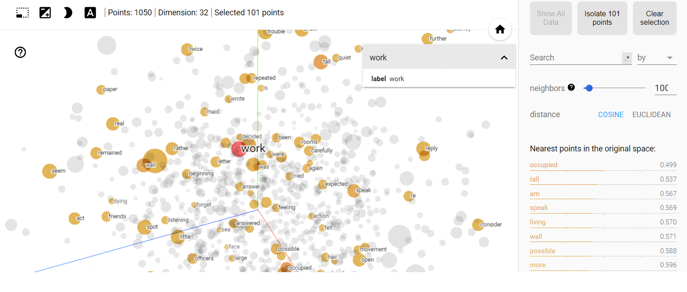

# Report Project 3 - igu011 and edj001

## Division of labor

We (igu011 and edj001) have worked very closely and paired programmed this project.

## Collabaration

We have had discussions with Alvar Hønsi during this project. We have not shared code but exchanged ideas and sources on how to solve the subproblems that come about during this project.

## Word embedding 
### 2.1.2: 
Top 20 occurences (without special characters):

- (71106, 'the')
- (43426, 'and')
- (33952, 'to')
- (30061, 'of')
- (23575, 'a')
- (18657, 'in')
- (20755, 'he')
- (16814, 'that')
- (15056, 'was')
- (14400, 'his')
- (13815, 'it')
- (10997, 'with')
- (10735, 'had')
- (9430, 'her')
- (9334, 'not')
- (10562, 'you')
- (9198, 'as')
- (9152, 'at')
- (8447, 'him')

We see the top 20 occurrences match with what we would expect with words like and, a that, it, and the. The vocabulary has a total of 1050 words when the minimum frequency is set to 100. There are a total of 30374 distinct words, so only 1050 of these may not be good enough to create a complete text generation model. For smart text generation, we think that the NGram model must understand the context between more words.

### 2.1.5: 
For the words, me, white, man, have, be, child, yes, what we reported the 10
most similar words. We find some words that are expected in the top 10. For example **be - am**, **have - had** and **what - how**.

### 2.1.6:
### Battlefield


### Happiness


### Looked


### Princess


### Sleep


### Work


In regards to task 2.1.5, we find better clusters than the words checked previously. It seems that outliers and special words used less frequently are better clustered, which is a bit surprising. It seems like for more normal words the NGram model has a harder time figuring out what is actually the context and similar words, but words used only a few time gets correctly clustered with the other words used in the same context. For example, Battlefield is surprisingly well clustered.


## Conjugating be and have 
### 2.2.2:
*Comment on the differences in terms of performances/training time between the MLP architecture and the RNN architecture.*

We trained a total of 4 models, the MLP architecture was a lot faster to train than the RNN architecture.
The performance of the RNN architecture was higher, but we saw an overfit to the training set with accuracy falling from 59% in the training set, 38% in the validation set, and 24% in the test set. The RNN architecture was still chosen as the best model since it had the highest validation accuracy. But the MLP model had more consistent results from 14% training accuracy to 13% validation accuracy.


## Report 
### 1. 
Give an explanation of your approach and design choices to help us understand how your particular implementation works.

Design choices

We wrote general train, accuracy, and model_selection functions that could be used for both MLP and RNN architecture models. This enabled us to reuse the functions in the different tasks, and this is also what we would have done in task 2.3.2 if the epochs would have not taken so much time.

### 2. and 3.
*Report the different models and hyper-parameters you have used. Report the performance of your selected model.*

**NGram**
```
loss_fn = nn.NLLLoss()
n_epochs = 4
lr = 0.1
embedding_dim = 16
optimizer = optim.SGD()

NGram | Train accuracy 20.57% | Validation accuracy 21.85%
```


**NGram_larger - Selected NGram model**
```
n_epochs = 20
lr = 0.1
embedding_dim = 64
optimizer = optim.SGD()

NGram_larger | Train accuracy 22.12% | Validation accuracy 23.09% | Test accuracy 24.06%
```
___

**MLP**
```
loss_fn = nn.NLLLoss()
n_epochs = 4
lr = 0.1
optimizer = optim.SGD()

MLP | Train accuracy 13.77% | Validation accuracy 12.70%
```

**MLP2**
```
loss_fn = nn.NLLLoss()
n_epochs = 20
lr = 0.001
optimizer = optim.Adam()

MLP_2 | Train accuracy 12.97% | Validation accuracy 10.00%
```

**RNN**
```
loss_fn = nn.CrossEntropyLoss()
n_epochs = 4
lr = 0.001
hidden_size=64
num_lstm_layers=1
optimizer = optim.SGD()

RNN | Train accuracy 8.28% | Validation accuracy 9.00%
```

**RNN2 - Selected conjugating model**
```
loss_fn = nn.CrossEntropyLoss()
n_epochs = 20
lr = 0.001
hidden_size=64
num_lstm_layers=2
optimizer = optim.Adam()

RNN_2 | Train accuracy 59.01% | Validation accuracy 37.92% | Test accuracy 24.06%
```

### 4.
*Comment your results. In case you do not get expected results, try to give potential reasons that would explain why your code does not work and/or your results differ.*

We are pleased with the results on the NGram model, and conjugating be and have. We did not expect accurate results, as stated in the task description it is hard to get good results. We are especially pleased with the word embeddings which was very cool to see clusters of similar words.


### Text generation 

The text generation task was quite frustrating since the training times were so long when using the entire vocabulary as the target. If all training times were fast we would have used the same model_selection function to pick the winner of a few different RNN models with different parameters such as learning rate, optimizer, and LSTM layers. Our attempt was with a context size of 2, meaning that we looked at the 2 previous words to predict the next word. If training was faster I expect one would get better results with more context.